# software-architecture-lab2

### 1. Setup Hazelcast
Run 3 hazelcast nodes in terminal

```bash
hz start -c "hazelcast-client.xml" -p 5701
```
Note: change port and config name if needed

When started run python script:
```bash
python3 name_of_file.py
```
<br>

Run management Management Center
```bash
hz-mc start
```

Optionaly you can run management Management Center using Docker:
```bash
docker pull hazelcast/management-center:5.3.4
```
<br>

```bash
docker run --rm -p 8080:8080 hazelcast/management-center:5.3.4
```

Optionaly run using client:
```bash
management-center/bin/start.sh
```

<br>

### 2. Run three nodes:
Code structure: <br>
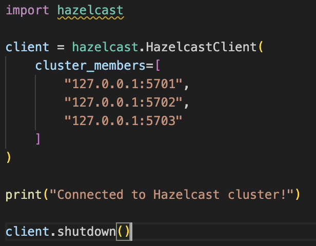
<br>

Successful run: <br>

<br>

Members present: <br>
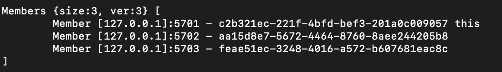
<br>

### 3. Show Distributed Map

Example of map write operation:
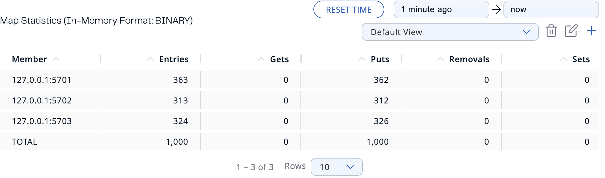
<br>

Delete one node:
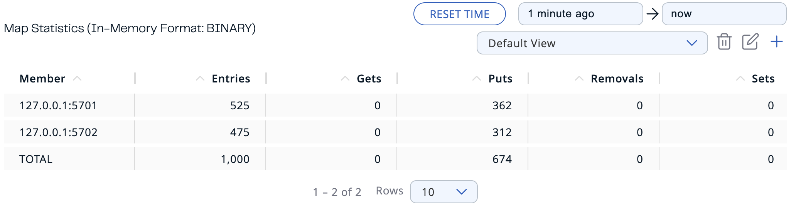
<br>

As we can see there is no loss(also we can see that on the image above in the bottom of Entries column):
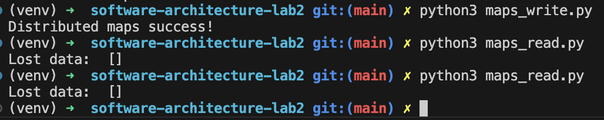
<br>

Next we delete another node:
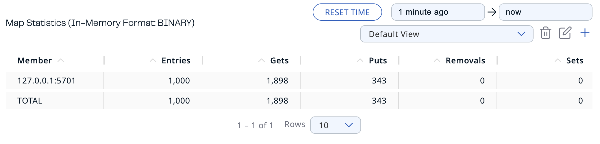
<br>

Now let's try to delete two nodes at ones
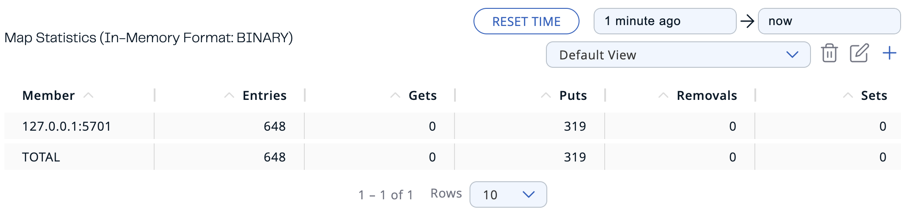
<br>

As we can see, data is lost. To avoid it, we need change structure of the configuration and add <b>backup-count</b> to config.


### 4. Distributed Map without locks

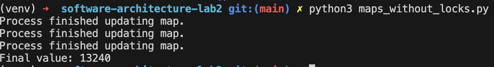
<br>
As you can see it doesn't reach value of 30000
One possible way to fix it, is to use <b>atomic opperations</b>

### 5. Distributed Map pessimistic lock
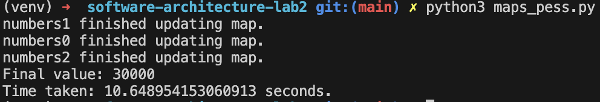
<br>

### 6. Distributed Map optimistic lock
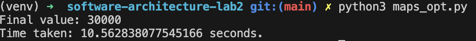
<br>

### 7. Compare Distributed Map without locks, Distributed Map pessimistic lock and Distributed Map optimistic lock

From images in tasks 4, 5 and 6 you can see that we have different outputs. For the implementation without locks, there should be an observable data loss; for the implementation with pessimistic and optimistic locks, the results should be the same. Optimistic approach works slightly better, however difference is not significant.


### 8. Bounded queue 
In this task, we set up a Hazelcast Bounded Queue with a capacity of 10 elements. One client produces values from 1 to 100, while two others consume from the queue. When two consumers are reading simultaneously, values are consumed in parallel. If the queue is full and no consumers are available, the producer faces issues in writing to the queue, demonstrating the queue's blocking behavior when full.

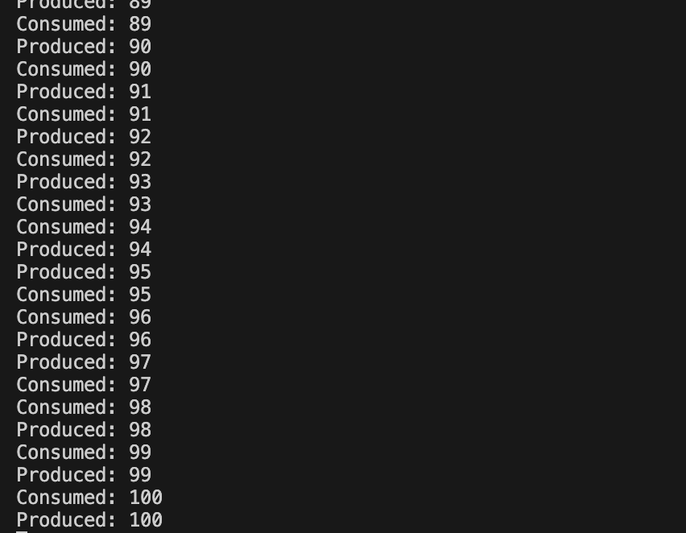
<br>

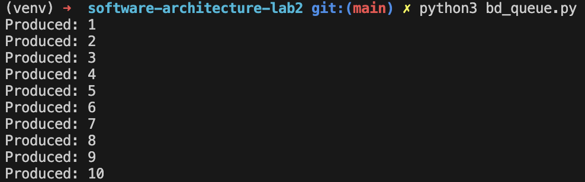
<br>
